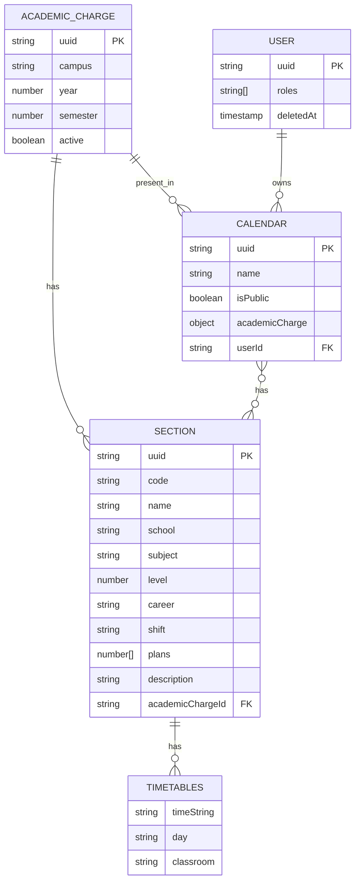

# Schema for the firestore database

> [!NOTE]
> Most of the resources has a `createdAt` and `updatedAt` field. These fields are automatically set by firestore. And are not included in this diagram to simplify it.

## Entity Relationship Diagram

As this is a NoSQL database, the relationships are not enforced by the database. But they are enforced by the application. And the diagram is only to show the relationships between the entities.  
Some of the relationships are show in the diagram but a resource may *include* that relationship inside the resource as a *de-normalized* field.



## Collections

### Academic Charge

This collection contains the academic charges that are available for the user to select.  
An academic charge is a group of sections that are available for a specific campus, year and semester.

```json
{
  "uuid": "string",
  "name": "string",
  "year": "number",
  "semester": "number",
  "active": "boolean"
}
```
## Calendars

The calendars are the main resource inside Duocmatico. This resource contains the sections that the user has selected for planning their semester.

The academic charge used to built the calendar is included inside the calendar resource. This is done to avoid the need of a join between the academic charge and the calendar.

```json
{
  "uuid": "string",
  "name": "string",
  "isPublic": "boolean",
  "academicCharge": {
    "uuid": "string",
    "name": "string",
    "year": "number",
    "semester": "number",
    "active": "boolean"
  },
  "userId": "string"
}
```

### Sections

The sections collection are a sub collection for two collections:
1. Academic Charges
2. Calendars

This collection contains the sections that are available for the user to select. Or view in case we are looking at a calendar.

A section contains a *de-normalized* timetables inside itself. Not as another sub collections. This was made for reduce the number of reads in the database.

```json
{
  "uuid": "string",
  "code": "string",
  "name": "string",
  "school": "string",
  "subject": "string",
  "level": "number",
  "career": "string",
  "shift": "string",
  "plans": [
    "number 1",
    "number 2",
  ],
  "academicChargeId": "string"
}
```